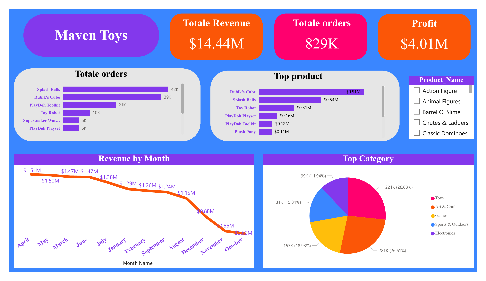

# 📊 Maven Toys Sales Analysis

## 📌 Overview

This project analyzes sales data for Maven Toys using Power BI to uncover key business insights and trends.

## 🔧 Tools Used

* Power BI
* Power Query
* DAX

## 📈 Key Insights

* Identified top-performing products and categories
* Analyzed sales trends over time
* Compared performance across different locations

## 📷 Dashboard Preview

## 🚀 Business Value

This dashboard helps stakeholders understand sales performance and make data-driven decisions.
